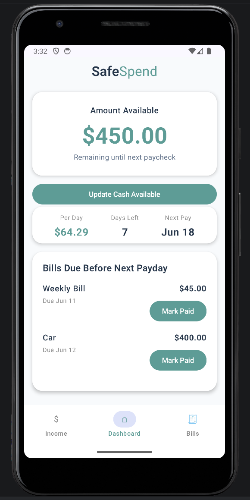
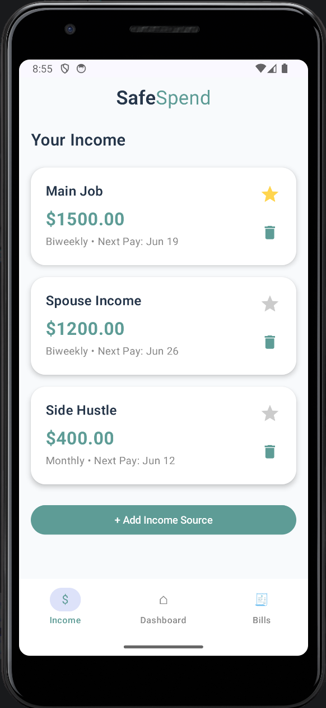
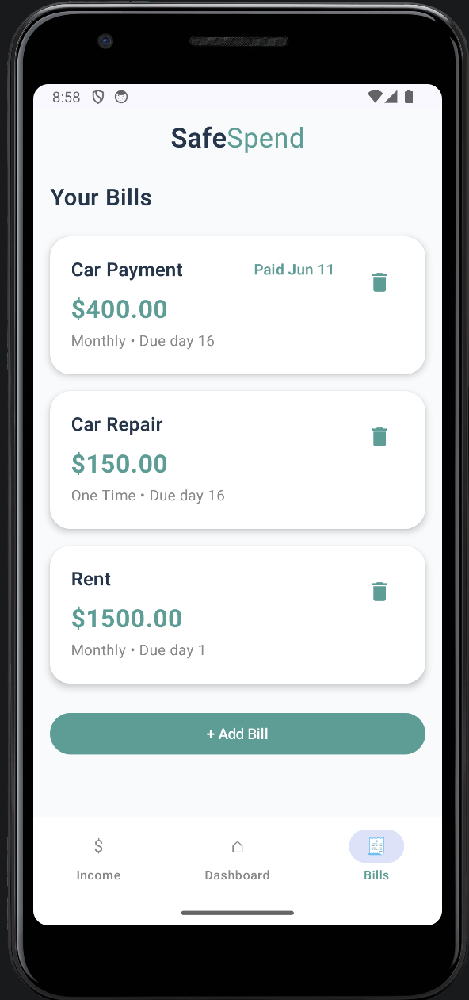
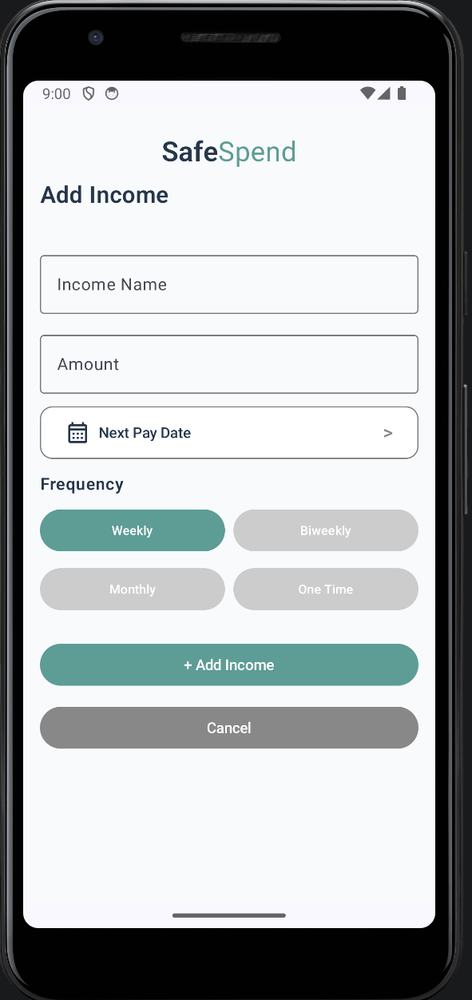
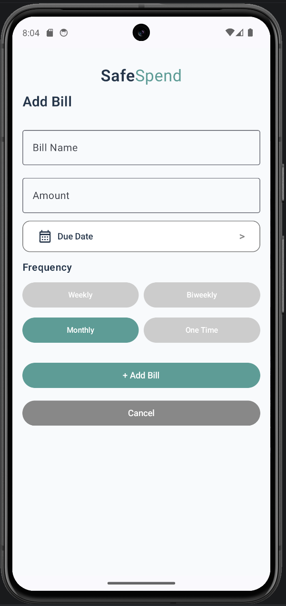
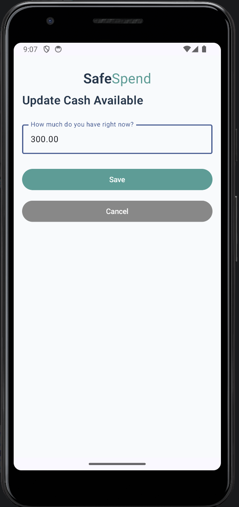

# SafeSpend

SafeSpend is a paycheck-focused Android budgeting app designed to help users quickly understand how much money they have available until their next payday.

The app focuses on a simple question:

> How much can I safely spend before my next paycheck?

SafeSpend helps users track available cash, income sources, upcoming bills, and bills due before the next pay period. It is designed to be simple, readable, and useful for people who want a clear picture of their money without complicated budgeting tools or required logins.

---

## Project Status

SafeSpend V1 is currently prepared for Google Play release.

The app has completed core feature testing, release build preparation, AdMob integration, privacy policy setup, and Google Play Console setup preparation.

---

## Features

- Track current cash available
- Add multiple income sources
- Set one primary income source
- Support weekly, biweekly, monthly, and one-time entries
- Add recurring or one-time bills
- See bills due before the next paycheck
- Mark bills as paid
- View available money per day
- Edit or delete income sources and bills
- Local storage with no account required
- Simple dashboard-first design
- Banner ad support through Google AdMob

---

## Screens

SafeSpend includes the following main screens:

- **Dashboard**  
  Shows amount available, per-day amount, days left, next payday, and bills due before the next paycheck.

- **Income**  
  Allows users to add, edit, delete, and set a primary income source.

- **Bills**  
  Allows users to add, edit, delete, and track recurring or one-time bills.

- **Update Cash Available**  
  Lets users quickly update how much money they currently have available.

---

## Built With

- Kotlin
- Jetpack Compose
- Android Studio
- Room / local device storage
- Google AdMob
- Google Play Console

---

## Design Goals

SafeSpend was built with a focus on:

- Simplicity
- Privacy
- Local-first storage
- Easy navigation
- Clear financial information
- Minimal setup
- No required account or login

The goal was to create a budgeting tool for users who are focused on managing money between paychecks, rather than building a complex long-term finance platform.

---

## Privacy

SafeSpend does not require an account or login.

Budget information such as income, bills, due dates, and cash available is stored locally on the user's device.

Privacy Policy:  
https://sites.google.com/view/trs-safespend-privacy-policy

---

## Testing Completed

SafeSpend V1 was tested for:

- Fresh install behavior
- App uninstall and reinstall
- Local data persistence
- Income add/edit/delete flow
- Bill add/edit/delete flow
- One-time bill behavior
- Recurring bill behavior
- Paid bill behavior
- Dashboard amount calculations
- Date edge cases
- Navigation stress testing
- Rotation behavior
- Larger screen testing
- AdMob banner integration
- Release build generation

---

## Release Preparation Completed

- App icon created
- Splash screen created
- Privacy policy published
- AdMob app created
- Banner ad integrated
- Test ads verified
- Live ad configuration tested
- Signed Android App Bundle created
- Release key created and backed up
- Google Play Console account created

---

## Screenshots

### Dashboard

### Income Screen

### Bills Screen

### Add Income

### Add Bill

### Update Cash Available

---
## Development Progress

SafeSpend was built through multiple design and testing iterations. The app started as a simple hardcoded dashboard and grew into a full local-storage Android budgeting app with income tracking, bill tracking, paid bill logic, dashboard calculations, AdMob integration, privacy policy setup, and release build preparation.

### Early Dashboard Prototype

### Dashboard Card Iteration

### Income Card Iteration

### Date Picker Added

### Date Validation Error

### Overdue Bill Logic

### AdMob Test Integration

## Notes

This repository is currently being used as a public project showcase for SafeSpend.  
The full production source code is not included in this public repository.

---

## Developer

Created by July Wellman  
Tiny Rebellion Studios
